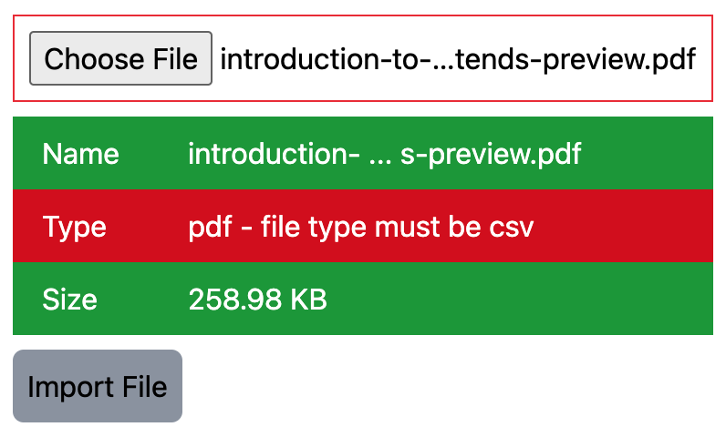

# vue-file-upload-tailwind
A file upload Vue component with validation styled with Tailwind CSS



## NOTE
If you need an unstyled version of this component, you can find it here:
https://www.npmjs.com/package/@builtwithjavascript/vue-file-upload


## External Dependencies
- Vue
- Tailwind CSS

## Other Dependencies
- @builtwithjavascript/file-input-validator

## Install
```
npm i -D @builtwithjavascript/vue-file-upload-tailwind
```

## Consume
```
import { FileUploadComponent } from '@builtwithjavascript/vue-file-upload-tailwind' 
import type { 
  IFileInfo,
  IFileValidatorOptions
} from '@builtwithjavascript/vue-file-upload-tailwind' 

const fileValidatorOptions: IFileValidatorOptions = {
  allowedTypes: ['csv', 'xls'],
  maxSize: 3, // in MB
  maxNameLength: 60, // max name length in chars
  nameTruncateMaxLength: 35, // will truncate the display of the name
  propertiesToValidate: ['name', 'type', 'size']
}

const onUploadClicked = async (fileInfo: IFileInfo) => {
  // do what you need to do with fileInfo.file
  // i.e. create form data and post it to an API endpoint
  const file = new FormData()
  file.append('file', fileInfo.file as Blob)

  const response = await someApiClient.post({
    file: file
  })

  ...
}

...

<FileUploadComponent 
  id="file-input" 
  uploadLabel="Import File"
  ref="refFileUploadComp"
  :validatorOptions="validatorOptions"
  :roundedCorners="true"
  :showOnlyErrors="true"
  successClass="success bg-pink-500"
  errorClass = "error bg-gray-500"
  inputCssClass = "border border-slate-500"
  @uploadClicked="onUploadClicked" />
```

NOTE: if you pass `showOnlyErrors` true, that only the validator items that fail will be displayed.

